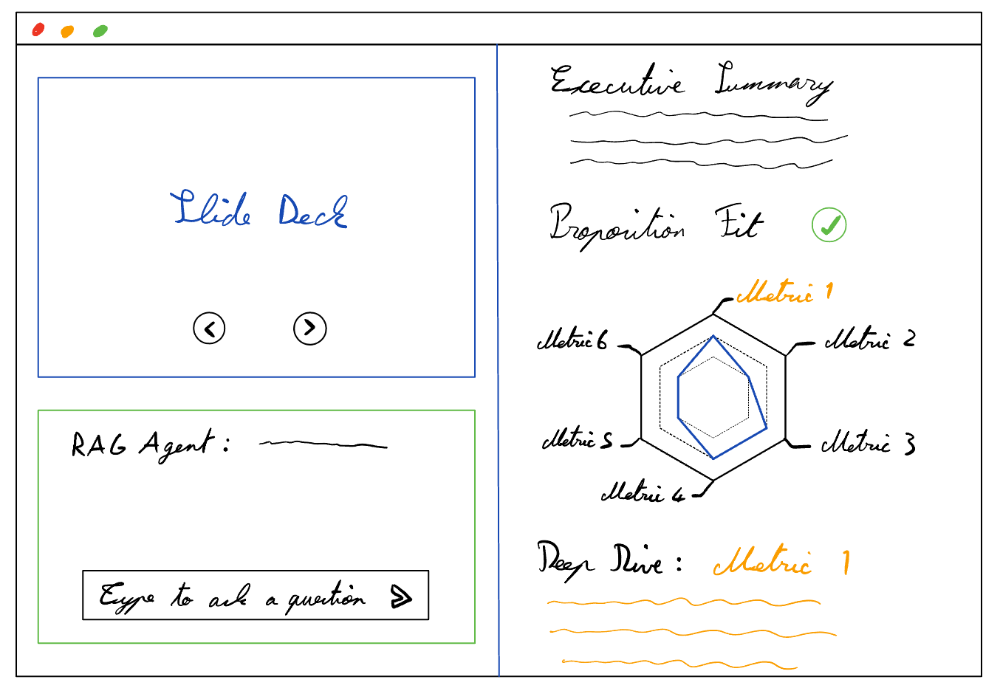

# Design Document

## **Overview**

This document outlines the design for an AI agent that:

1. **Ingests a pitch deck** (PDF/slides) and preprocesses slides.
2. **Generates an Executive Summary** capturing key investor insights.
3. **Evaluates Proposition Fit** against a user-defined Investment Thesis.
4. **Performs a Deep Evaluation** across six metrics using RAG.
5. **Provides an Interactive RAG Chat** for slide-based Q&A and navigation.

---

---

## **1. Deck Ingestion & Preprocessing**

**Steps:**

1. User uploads a PDF or PPT file.
2. Extract text (and any embedded image text) per slide.
3. Store slides with metadata (slide number).
4. Create embeddings and index slides for retrieval.

---

## **2. Executive Summary**

**Goal:** Generate a concise summary that highlights:

- Vertical and target customer segment
- Core problem and solution
- Business model and revenue approach
- Traction highlights
- Fundraising ask

**Workflow:**

- Feed full deck text into an LLM with a single prompt template.
- Receive free-form summary covering the above points.

---

## **3. Proposition Fit Evaluation**

**Goal:** Check high-level alignment with an investment thesis before deep analysis.

**Inputs:**

- Executive Summary
- *User-defined Investment Thesis* (verticals, geography, stage, traction, ticket size)
- <placeholder> Investment Thesis Template </placeholder>

**Workflow:**

- Prompt the LLM to compare summary against the thesis: “Fit? Yes/No + rationale.”

---

## **4. Deep Evaluation: Six-Metric RAG Scoring**

**Goal:** Score the deck on six critical dimensions using RAG to retrieve supporting slide content.

### **4.1 Metrics & Sub-Questions**

| # | Metric                        | Definition / Rationale                                                                                   | Sub-questions for RAG retrieval                                                                                                                                                         | 1–5 Rubric Anchor (summary)                                                                                  |
|---|-------------------------------|-----------------------------------------------------------------------------------------------------------|------------------------------------------------------------------------------------------------------------------------------------------------------------------------------------------|--------------------------------------------------------------------------------------------------------------|
| 1 | Problem & Market Need         | Tests whether a clear, focused narrative presents a sizable, urgent pain, backed by evidence and a unique market insight. | • What pain points are named and for whom? • Is urgency or frequency quantified (cost, time, risk)? • Is the need supported by data, customer quotes, or spend figures? • Do founders present a unique or contrarian market insight? • Does the problem narrative stay consistent across the tagline and the deck? | 1 = Vague problem, no data. 3 = Clear pain with anecdotal proof. 5 = Critical, quantified pain with hard evidence + unique insight + coherent story. |
| 2 | Solution & Value Proposition  | Evaluates how concretely the product solves the pain, how intuitive the value prop is, and whether the solution is defensible. | • Does the product workflow map directly to the pain points? • Is the value proposition clear and concrete (specific benefit)? • Is there a functional product or convincing prototype in market? • Is the solution defensible / hard to replicate (tech, data, IP, network)? | 1 = Unclear solution or vague benefit. 3 = Logical fit, clear proposition, some proof points. 5 = Crystal-clear benefit + live proof + clear moat. |
| 3 | Market Size & Capture Strategy| Combines TAM/SAM realism, GTM plan, and competitive landscape—i.e., can they win a big enough slice?     | • Are TAM, SAM, and SOM broken down with sources? • Is the initial target segment actionable? • Is competition mapped and a differentiated wedge stated? • Is the GTM / CAC vs. LTV (or proxy) discussed or quantified? | 1 = Hand-wavy “1% of huge market.” 3 = Basic segmentation + GTM sketch. 5 = Data-backed sizing, clear beach-head, differentiated wedge, credible CAC/LTV. |
| 4 | Traction & Business Model Viability | Looks for demand proof and a scalable, feasible path to revenue and customer acquisition.                  | • What hard traction metrics (users, revenue, pilots) are disclosed? • Are growth curves tied to a repeatable acquisition channel? • Is CAC vs. LTV (or a realistic proxy) quantified or trending favourably? • Is there a clear customer-acquisition strategy embedded in the model? | 1 = No traction, unclear model. 3 = Early signals + basic pricing. 5 = Strong growth/retention, validated unit economics, explicit acquisition engine. |
| 5 | Team & Execution Capability   | Assesses founder–market fit, relevant experience, and ability to hire and execute.                        | • Do backgrounds match domain and tech needs? • Any prior exits, patents, or deep-tech creds? • Is motivation linked to success drivers? • Are key talent gaps acknowledged with a hiring plan? | 1 = Misaligned team. 3 = Reasonable fit, some gaps. 5 = Uniquely qualified or repeat performers with clear roadmap. |
| 6 | Investment Ask & Vision       | Judges whether the raise, milestone plan, and long-term vision warrant a VC bet.                          | • How much capital is requested at this stage? • Are use-of-funds tied to concrete milestones/KPIs? • Is the vision large enough for venture-scale returns and time-aligned? • Are valuation and timeline expectations realistic? | 1 = Unrealistic ask or vague spend plan. 3 = Reasonable ask + milestone list. 5 = Well-calibrated ask, KPI-driven, inspiring long-term upside. |

### **4.2 Evaluation Workflow**

For each metric:

1. Retrieve relevant slide passages via embedded queries.
2. Prompt the LLM with passages and scoring rubric.
3. Extract a 1–5 score and brief justification.

### **4.3 Visualization & Interaction**

- Display metric scores on a radar (hexagon) chart.
- Selecting a metric shows detailed analysis and links to cited slides.

---

## **5. Interactive RAG Chat Interface**

**Goal:** Allow users to ask questions and navigate to slides directly.

**Workflow:**

- User asks a question → retrieve top-n slides → LLM answers with slide citations.
- UI jumps to cited slide upon clicking references.

---

*End of Design Document*